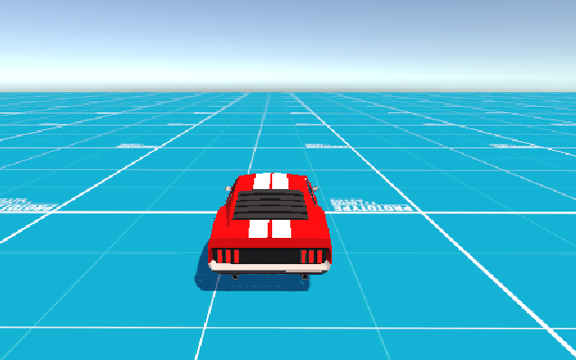
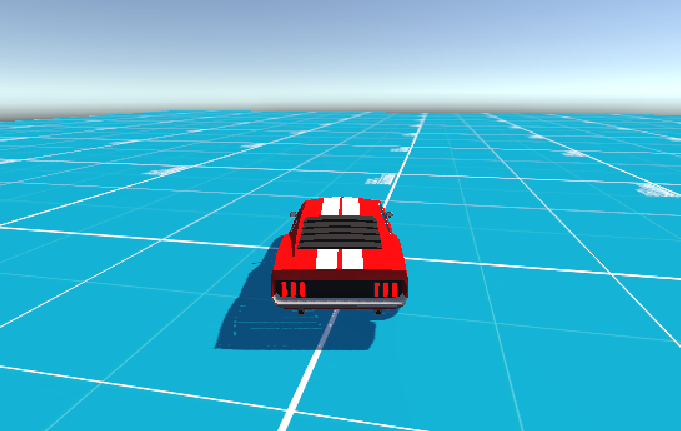
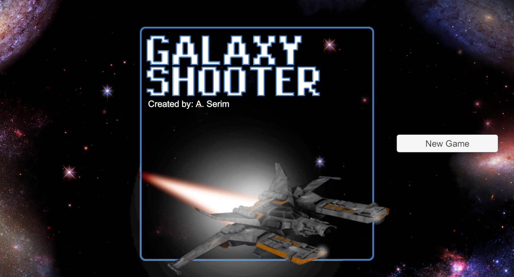
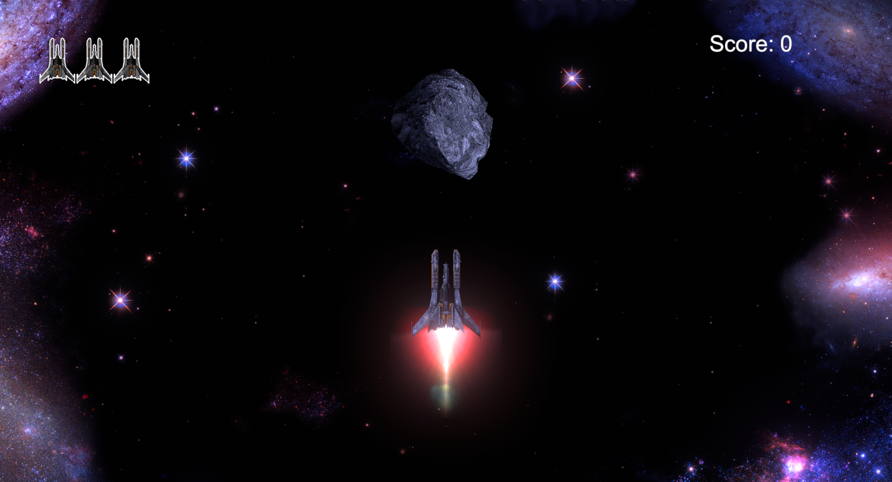
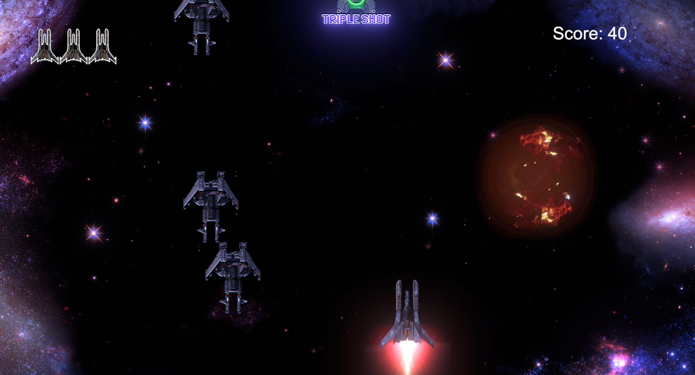
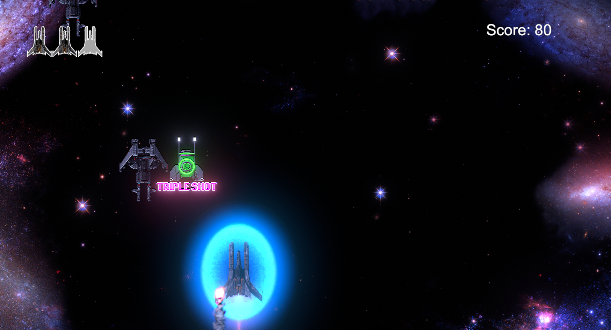
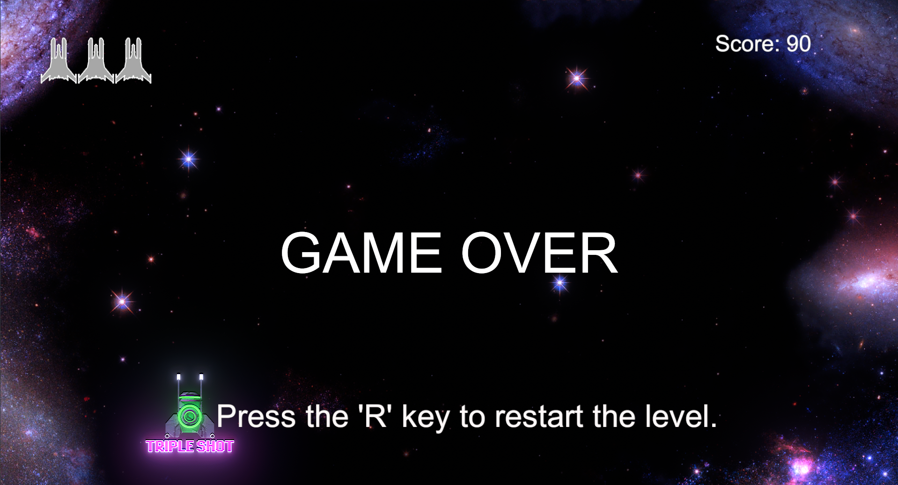

# Unity Projects

A collection of my public Unity projects showcasing different gameplay mechanics, systems and experiments.

## Projects

### Vehicle Controller Prototype

A simple vehicle controller prototype built in Unity, featuring basic driving mechanics such as steering, acceleration and braking.

  
  

### Galaxy Shooter Game

A 2D space shooter game developed in Unity by following a Udemy course. Features three unique power-ups (Speed Boost, Triple Shot and Shield), player lives, and score tracking. Built to practice core Unity concepts such as player movement, shooting mechanics, collisions, UI and game management.

    
    
    
    
  

